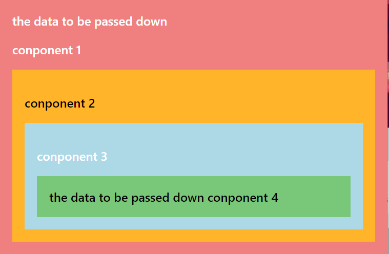

# A simple example of Context API
# Introduction
A simple example explaning the process of how I understand Context API in React step by step with practice 
This learning process was inspired by the tutorials: https://www.youtube.com/watch?v=hHbWF1Bvgf4
# Screenshot

